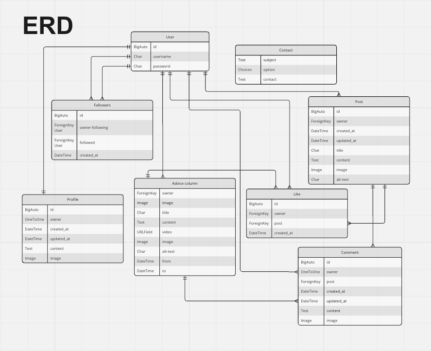
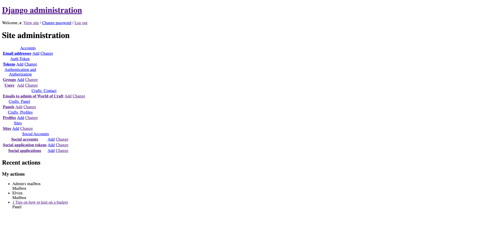

# Introduction
The World of Craft website is an app for people who like DIY projects and handmade crafts. The website allows the users to post their projects, find inspiration in other people's projects and overall interact within a crafty community.

# 

## ERD

I chose to overwrite the Django rest auth settings for signing in from username to email as I find it more difficult to remember a username than your email adress you signed up with. So to improve user experience, I changed the default setting of requiring username to requiring email at sign in.

## Bugs
I was stuck on the POST method of creating a post in the frontend for quite a while. As I pressed the submit button, it gave me a 500 Error (internal error). I was helped along by tutor Alan and tutor Oisin at the Code Institute to find the solution which was to untrack the env.py file and the /venv folder and add them to my .gitignore file. This enabled me to start creating posts on the app. I also used this online resource for instructions on how to untrack files:
(https://stackoverflow.com/questions/1274057/how-do-i-make-git-forget-about-a-file-that-was-tracked-but-is-now-in-gitignore)

[Solution: set debug to true](https://stackoverflow.com/questions/40773246/css-style-is-missing-in-all-my-django-applications)

# Credits

## Code Used

I have followed some tutorials and I have used several resources to reach my goals in my project. Below are some of the codes I have used, tutorials I have followed and some of the links to pages that have guided me a little bit to go in the right direction.

[How to use the choices field oprion in Django](https://stackoverflow.com/questions/18676156/how-to-properly-use-the-choices-field-option-in-django)

[How to send email with Django](https://www.youtube.com/watch?v=xNqnHmXIuzU)

[Django documentation on send_email()](https://docs.djangoproject.com/en/5.0/topics/email/)(https://docs.djangoproject.com/en/5.0/ref/settings/#std-setting-ADMINS)

[Django REST-auth documentation on userdetail serializer](https://dj-rest-auth.readthedocs.io/en/latest/faq.html)

[How to add minimum length to text fields in Django models](https://stackoverflow.com/questions/15845116/how-to-set-min-length-for-models-textfield)
