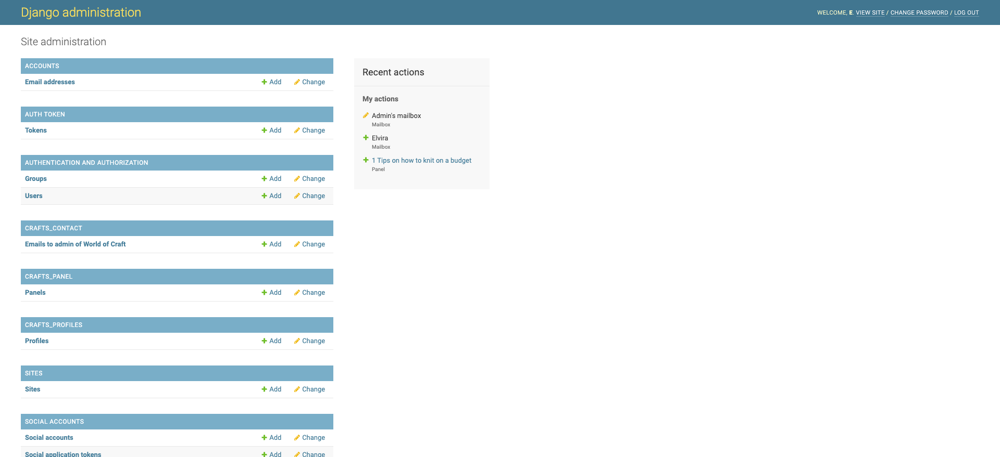

# Introduction
The World of Craft website is an app for people who like DIY projects and handmade crafts. The website allows the users to post their projects, find inspiration in other people's projects, the admin's tips and tricks for crafters and overall interact within a crafty community.

You can find the live website here: (https://world-of-craft-frontend-f2bcd7b16534.herokuapp.com/)

# User Stories
The user stories are available to see in this GitHub project: (https://github.com/users/e-tidemo/projects/9)
The user stories are also as follows:

# User experience
Overall, the aim of this app is to be accessible through aria-labels and well contrasting colours throughout the site. This is also the reason why the admin advice panel always have an alt-attribute to the images so that people with impaired vision or who use screen readers will always get a site interpretation.

I also chose to overwrite the Django rest auth settings for signing in from username to email as I find it more difficult to remember a username than your email adress you signed up with. So to improve user experience, I changed the default setting of requiring username to requiring email at sign in.

# Design

[Why using dark colours on a website is more environmentally friendly](https://endtimes.dev/actually-dark-mode-can-save-the-world/)

## ERD

## Bugs
I was stuck on the POST method of creating a post in the frontend for quite a while. As I pressed the submit button, it gave me a 500 Error (internal error). I was helped along by tutor Alan and tutor Oisin at the Code Institute to find the solution which was to untrack the env.py file and the /venv folder and add them to my .gitignore file. This enabled me to start creating posts on the app. I also used this online resource for instructions on how to untrack files:
(https://stackoverflow.com/questions/1274057/how-do-i-make-git-forget-about-a-file-that-was-tracked-but-is-now-in-gitignore)

I had the issue that the admin panel looked like the image below rather than the usual styling for the django admin panel.

I never quite figured out when my staticfiles had disappeared but I looked for many ways to solve it. First I found the solution that I needed to set Debug to True in my settings. This worked, but I knew I needed a more sustainable solution for a production environment, when the project was no longer in the development environment.

[Solution: set debug to true](https://stackoverflow.com/questions/40773246/css-style-is-missing-in-all-my-django-applications)

So what I gathered from different resources online was that I should be able to run the command "collectstatic" but this gave me no result. I then started suspecting that I might have missed running the command "django-admin startproject" when I restarted my project again. So my solution became that I started a temporary django project to run the command "collectstatic" which generated 128 static files. I then copied these files into my project and the admin panel was back to looking like it should.

As I started building my contact page in the frontend, quite soon I was stuck again. I had the function working in the backend and I got success messages in the frontend console but I didn't see any messages coming through in the admin panel. So, because of a lack of time to look for other solutions, I made a temporary solution where I linked the backend url to the "contact us" icon in the navbar. This is, of course, just a temporary solution but it will at least ensure that the messages site visitors want to send to the admin are getting through. I kept all the set up for the frontend to take over eventually (such as csrf tokens etc.) and just changed the url in the link for the navbar.

# Credits

### Sources

Favicons:
The favicon for the website is collected from [Favicon.io](https://favicon.io/)
[Upload symbol by Ilham Fitrotul Hayat](https://www.flaticon.com/free-icon/upload_3097412?term=upload&page=1&position=2&origin=search&related_id=3097412)

## Code Used

I have followed some tutorials and I have used several resources to reach my goals in my project. Below are some of the codes I have used, tutorials I have followed and some of the links to pages that have guided me a little bit to go in the right direction.

[How to use the choices field oprion in Django](https://stackoverflow.com/questions/18676156/how-to-properly-use-the-choices-field-option-in-django)

[How to send email with Django](https://www.youtube.com/watch?v=xNqnHmXIuzU)

[Django documentation on send_email()](https://docs.djangoproject.com/en/5.0/topics/email/)(https://docs.djangoproject.com/en/5.0/ref/settings/#std-setting-ADMINS)

[Django REST-auth documentation on userdetail serializer](https://dj-rest-auth.readthedocs.io/en/latest/faq.html)

[How to add minimum length to text fields in Django models](https://stackoverflow.com/questions/15845116/how-to-set-min-length-for-models-textfield)
